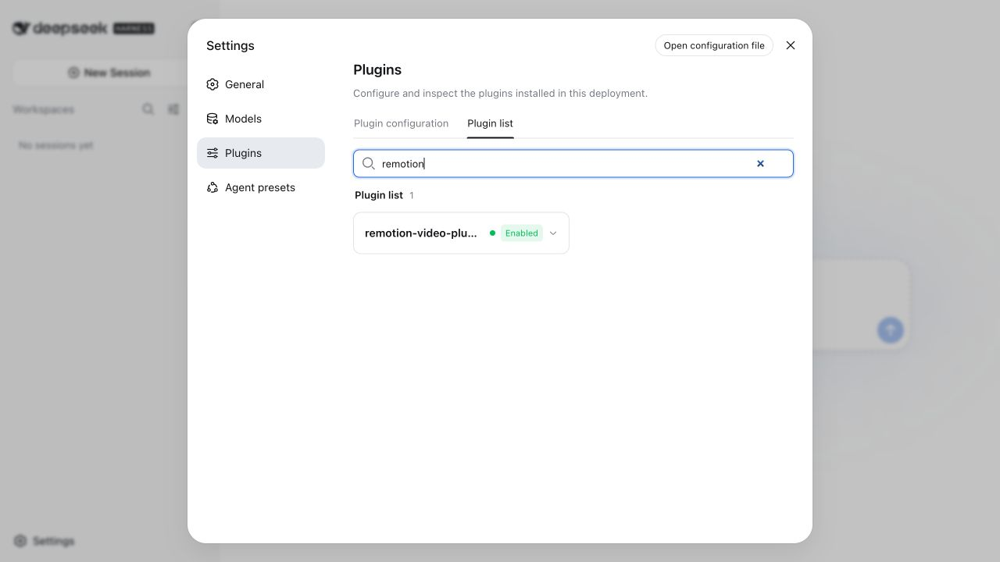

# Smoke-test results

## 2026-08-22 - version 0.4.0 release candidate

Result: **LOCAL CONTRACTS PASS; HOSTED RENDER GATE PENDING**

Environment:

- DeepSeek Harness local checkout: `0.1.0-rc.5`
- Harness commit: `028eeb2dbb9f` (checkout already had unrelated local changes)
- Node.js: `22.22.0`
- npm: `10.9.4`; profile pnpm: `11.22.0`
- Host: macOS restricted workspace

Evidence:

1. `npm run check` passed 7 unit/contract tests, validated 10 bilingual model-to-render cases, compiled TypeScript, and inspected a 47-file npm payload.
2. `npm run release:verify` confirmed the stable version, matching lockfile and changelog, synchronized README release number, both Cordis rows, full integration command, and npm OIDC/publication contract.
3. `npm --prefix demo run lint` passed ESLint and TypeScript checks.
4. The real Harness `ToolRuntime` and `LocalSubprocessRuntime` mounted the tools plugin. Probe-only passed `remotion_doctor` and `remotion_probe_output` against the checked-in real render.
5. ffprobe reported H.264 video at 1280×720 and 30 fps, AAC stereo audio at 48 kHz, 12.053333-second duration, and 2,148,862 bytes.
6. The `0.4.0` tarball was unpacked and its 47-file payload inspected. It contained no `node_modules`, local environment files, or credentials; the final tarball checksum belongs in the GitHub release because a package cannot contain its own stable hash.
7. That tarball installed into a brand-new isolated Web profile. `pnpm peers check` reported no peer issues, and the composed config contained both `remotion-video-plugin` and `remotion-video-tools`.
8. Current files, packed files, tracked filenames, and Git history produced no match for the reviewed common secret/key patterns or sensitive filenames.
9. The lockfile-only plugin install reported zero vulnerabilities from available npm data. A live audit refresh for the demo could not resolve `registry.npmjs.org`; the earlier 0.1 release record remains the last successful live demo audit.

External gates not claimed as passed:

- Full `npm run test:e2e` reached the real managed Remotion command but the restricted local host refused to launch Chrome (`Failed to launch the browser process`). The GitHub-hosted integration workflow must freshly discover compositions and render both artifacts before release.
- The isolated Web bundle installed and composed correctly, but this sandbox rejected the server bind with `listen EPERM` on `127.0.0.1:3094`; therefore no new 0.4 browser inventory screenshot or HTTP 200 claim is made here.
- npm publication, provenance, GitHub release/tag, and community post updates remain pending until the release commit is pushed and hosted checks pass.

## 2026-08-21 - version 0.1.0

Result: **PASS**

Environment:

- DeepSeek Harness local checkout: `0.1.0-rc.5`
- Harness commit: `028eeb2dbb`
- Node.js: `22.22.0`
- Profile package manager: pnpm `11.22.0`
- Host: macOS

Evidence:

1. `npm run check` passed two provider and bundle tests, compiled the TypeScript source, and validated the package contents.
2. `npm audit` reported zero known vulnerabilities in both the plugin and reproducible demo dependency sets.
3. The `0.1.0` tarball installed into a new isolated Harness Web profile through `dsh plugin --profile web add <tarball>`.
4. `pnpm peers check` reported `No peer dependency issues found` in the generated profile.
5. Harness added `@chenjie1129/dsh-remotion-video-plugin` to the profile dependency list and bundle stack.
6. `dsh --profile web --dump-config` contained the `remotion-video-plugin` Loader row.
7. The final release artifact was reinstalled into a brand-new isolated profile; the real Harness Web runtime started on `127.0.0.1:3093` and returned HTTP 200.
8. Browser verification rendered the DeepSeek Harness new-session UI without an error overlay.
9. The Harness Settings plugin inventory filtered to exactly one Remotion result and reported `remotion-video-plugin` as mounted and enabled.
10. After the final stable load, browser logs contained no new warnings or errors.
11. The included Remotion composition passed ESLint and TypeScript checks and rendered a 12-second H.264 MP4 at 1280×720 and 30 fps.

The optional model-token smoke test was not run because the isolated test profile intentionally contained no API key. Provider lifecycle tests directly verified that `ctx.skills.list()` exposes `remotion-video`, `ctx.skills.get()` loads its packaged instructions, and plugin disposal removes it.
